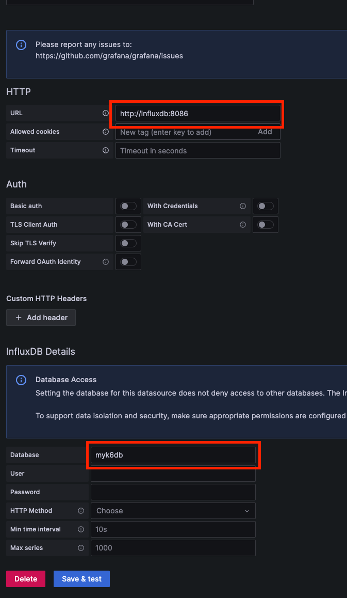
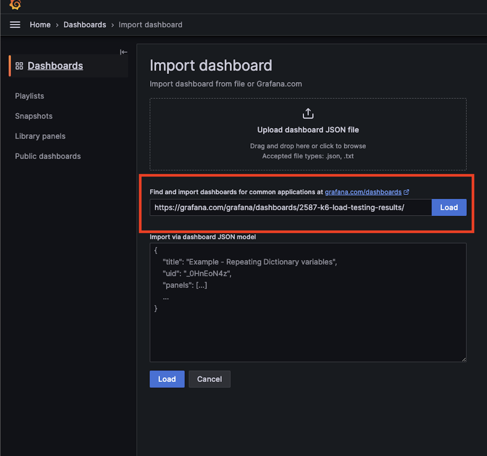
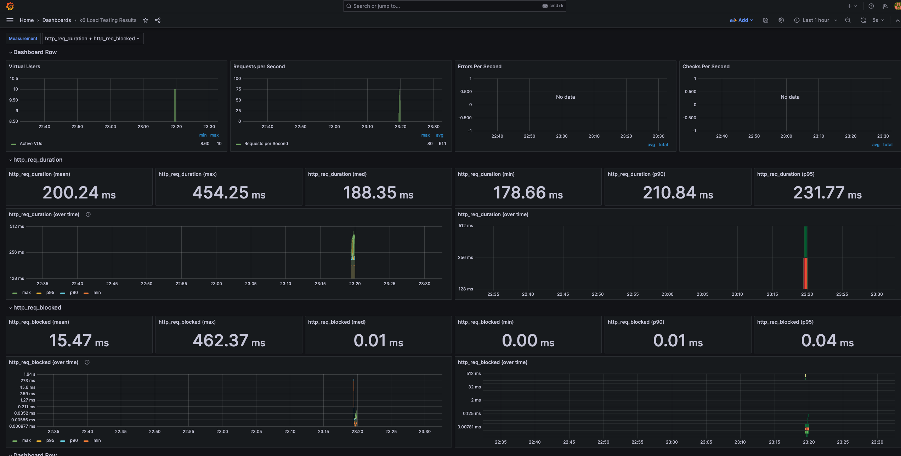

# Grafana k6
빠르고 쉽게 Grafana k6를 통해 성능 테스트를 수행하고 결과를 시각화 하기 위해 빠르게 환경을 구축하기 위한 템플릿 프로젝트 입니다.

## 설치방법

```bash
brew install k6
```

## 실행 테스트
- 실행하기
```bash
k6 run test.js
```

- 실행 결과 확인
```bash

          /\      |‾‾| /‾‾/   /‾‾/   
     /\  /  \     |  |/  /   /  /    
    /  \/    \    |     (   /   ‾‾\  
   /          \   |  |\  \ |  (‾)  | 
  / __________ \  |__| \__\ \_____/ .io

  execution: local
     script: test.js
     output: InfluxDBv1 (http://localhost:8086)

  scenarios: (100.00%) 1 scenario, 10 max VUs, 1m0s max duration (incl. graceful stop):
           * default: 10 looping VUs for 30s (gracefulStop: 30s)


     data_received..................: 2.6 MB 83 kB/s
     data_sent......................: 47 kB  1.5 kB/s
     http_req_blocked...............: avg=15.46ms  min=1µs      med=5µs      max=462.37ms p(90)=8µs      p(95)=34.09µs 
     http_req_connecting............: avg=9.02ms   min=0s       med=0s       max=228.03ms p(90)=0s       p(95)=0s      
     http_req_duration..............: avg=200.24ms min=178.65ms med=188.35ms max=454.25ms p(90)=210.84ms p(95)=231.75ms
       { expected_response:true }...: avg=200.24ms min=178.65ms med=188.35ms max=454.25ms p(90)=210.84ms p(95)=231.75ms
     http_req_failed................: 0.00%  ✓ 0         ✗ 428 
     http_req_receiving.............: avg=5.44ms   min=18µs     med=83.5µs   max=223.69ms p(90)=146.6µs  p(95)=252.14µs
     http_req_sending...............: avg=23.93µs  min=4µs      med=21µs     max=678µs    p(90)=29µs     p(95)=35µs    
     http_req_tls_handshaking.......: avg=4.71ms   min=0s       med=0s       max=234.23ms p(90)=0s       p(95)=0s      
     http_req_waiting...............: avg=194.77ms min=178.57ms med=187.87ms max=332.7ms  p(90)=209.84ms p(95)=215.33ms
     http_reqs......................: 428    13.654758/s
     iteration_duration.............: avg=1.43s    min=1.36s    med=1.39s    max=2.17s    p(90)=1.54s    p(95)=1.61s   
     iterations.....................: 214    6.827379/s
     vus............................: 3      min=3       max=10
     vus_max........................: 10     min=10      max=10


running (0m31.3s), 00/10 VUs, 214 complete and 0 interrupted iterations
default ✓ [======================================] 10 VUs  30s
```

## 실행 결과 시각화

- grafana / influxDB 도커로 실행
```bash
# ./docker-compose.yml 참고
docker compose up -d
```

- influx 실행 확인
```bash
influx ping
=> ok
```

- influx 명령어가 실행되지 않을 땐 influxdb-cli 설치
```bash
brew install influxdb-cli
```

- grafana 접속
```
http://localhost:3000/
id: admin
pw: admin
```

- Datasource 추가하기  
Home > Connections > Data sources > influxdb 메뉴에서 아래와 같이 추가



- Dashboard 추가하기
Home > Dashboards > Import dashboard 메뉴에서 k6 대시보드 추가

(https://grafana.com/grafana/dashboards/2587-k6-load-testing-results/)


위 화면에서 Load 누른 후, 데이터 소스를 influxDb로 설정할 것

- Dashboard 확인
아래와 같은 결과가 나오면 성공


